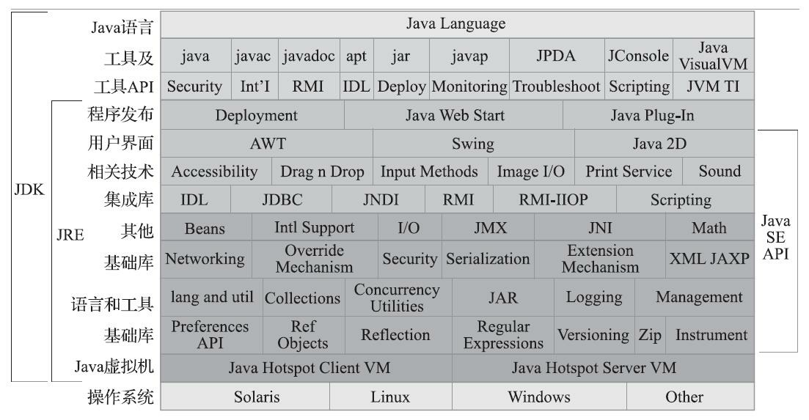
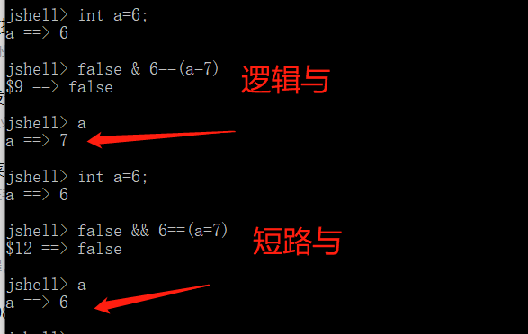
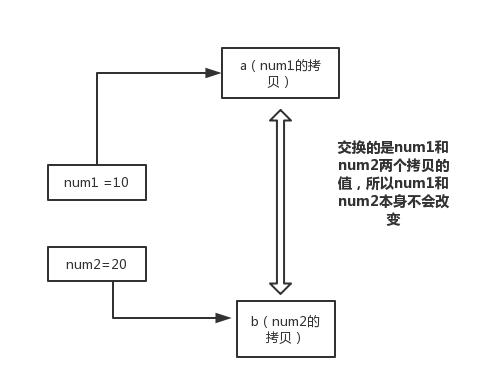
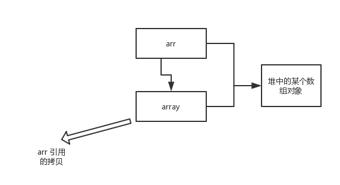
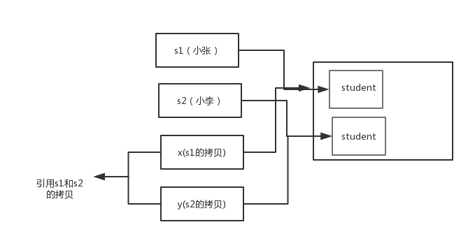
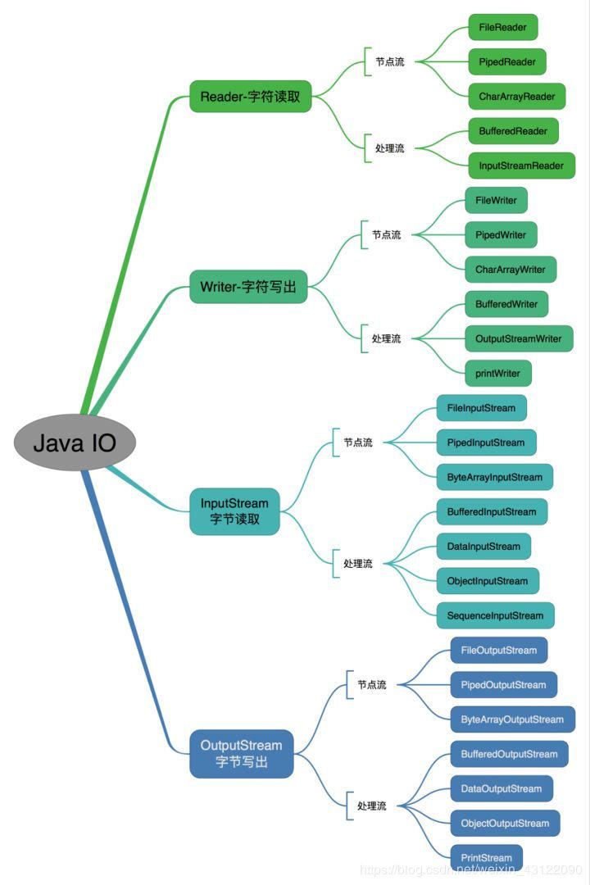

# Java SE总结

## Java概述

**何为编程**

* 让计算机解决某个问题而使用某种程序设计语言编写程序代码，最终得到结果的过程
* 将解决问题的思路、方法和手动通过计算机能够理解的形式告诉计算机，使得计算机根据人的指令去完成任务

**什么是Java**

* Java是一门面向对象的编程语言，吸收了C++语言的有点病摒弃了C++中难以理解的多继承和指针等概念。功能强大且简单易用。

**JDK5后三大版本**

* Java SE（J2SE，标准版）：开发和部署在桌面、服务器、嵌入式环境和实时环境中使用的Java应用程序，Java SE包含了支持Java Web服务开发的类，并为Java EE和Java ME提供基础
* Java EE（J2EE，企业版）：帮助开发和部署可移植、健壮、可伸缩且安全的服务器端Java应用程序。Java EE是在Java SE的基础上构建的，它提供Web服务、组件模型、管理和通信API，可以用来实现企业级的面向服务体系结构（SOA）和Web2.0应用程序
* Java ME（J2ME，微型版）：为移动设备和嵌入式设备（如手机、PDA、电视机顶盒和打印机）上运行的应用程序提供一个健壮且灵活的环境

**JDK&JRE&JVM**

`JDK>JRE>JVM`



**什么是跨平台性？原理是什么**

* 所谓跨平台性，是指Java语言编写的程序，一次编译后，可以在多个系统平台上运行
* 实现原理：java程序是通过Java虚拟机在系统平台上运行的，只要该系统安装相应的Java虚拟机即可运行Java程序

**Java语言特点**

* 简单易学（语法和C语言、C++类似）
* 面向对象（继承、封装、多态）
* 平台无关性（Java虚拟机实现平台无关性）
* 支持网络编程且很方便（Java语言诞生本身就是为简化网络编程设计的）
* 支持多线程（多线程机制使应用程序在同一实际并行执行多项任务）
* 健壮性（Java语言的强类型机制、异常处理、垃圾的自动收集等）
* 安全性好

**什么是字节码？采用字节码的好处是什么？**

* 字节码：Java源代码经过虚拟机编译后产生的文件（.class文件），它不面向任何特定的处理器，只面向虚拟机
* 好处：在一定程度上解决了传统解释型语言执行效率低的问题，同时又保留了解释型语言可移植的特点。因此既保证了执行消息又具备可移植性
* 编译器&解释器：Java源代码---->编译器---->JVM可执行的Java字节码（即虚拟指令）---->JVM---->JVM中解释器---->机器可执行的二进制机器码---->程序运行

**什么是Java程序的主类？应用程序和小程序的主类不同点？**

* 一个程序可以有多个类，但只能有一个类是主类。在Java应用程序中，这个主类是指包含main()方法的类。而在Java小程序中，这个主类是一个继承自系统类JApplet或Applet的子类，应用程序的主类不一定要求是public类，但小程序的主类必须是public类。主类是Java程序执行的入口点。

**Java应用程序和小程序直接的差别**

* 应用程序是从主线程启动（即main()方法）。applet小程序没有main方法，主要是嵌在浏览器页面上运行（调用init()方法或run()方法来启动），嵌入浏览器类似flash小游戏。

**Java和C++的区别**

* 都是面向对象的语言，都支持继承、封装、多态
* Java不提供指针来直接访问内存，程序内存更加安全
* Java的类是单继承的，C++支持多重继承。Java可以解开多继承
* Java有自动内存管理机制，不需要程序员手动释放无用内存

**Oracle JDK&OpenJDK**

* Oracle JDK版本将没三年发布一次，而OpenJDK版本每三个月发布一次
* OpenJDK是一个参考模型并且完全开源，而Oracle JDK是OpenJDK的一个实现，并不是完全开源
* Oracle JDK比OpenJDK更稳定。二者代码几乎相同，但Oracle JDK有更多的类和一些错误修复
* 在响应时间和JVM性能方面，Oracle JDK与OpenJDK相比提供了更好的性能
* Oracle JDK不会为发布的版本提供长期支持，用户必须更新到最新版本获得支持
* Oracle JDK根据二进制diamante许可协议获得许可，而OpenJDK根据GPL v2许可获得


## 基础语法

### 数据类型

**Java有哪些数据类型**

**定义：**Java语言是强类型语言，对于每一种数据都定义了明确的具体的数据类型，在内存中分配了不同大小的内存空间

**分类**

* 基本数据类型
  * 数值型
    * 整数类型（byte，short，int，long）
    * 浮点类型（float，double）
  * 字符型（char）
  * 布尔型（boolean）
* 引用数据类型
  * 类（class）
  * 接口（Interface）
  * 数组（[]）

**Java基本数据类型图**


**switch是否能作用在byte/long/String上**

* 在Java 5以前，switch(expr)中expr只能是byte、short、char、int。从Java 5开始，Java中引入了枚举类型，expr也可以是enum类型，从Java 7开始，expr还可以是字符串（String），目前长整型（long）是不支持的

**最高效的计算2*8**

* 2 << 3

**Math.round(num)**

四舍五入，原理：参数＋0.5，再进行下取整


**float f=3.4**

* 3.4为双精度，需要强制类型转换，float f = (flat)3.4; 或者 float f = 3.4F;

**short s1 = 1;s1 = s1 + 1; VS short s1 = 1;s1 +=1;**

* 由于 1 是 int类型，因此 s1+1 运算结果也是int类，赋值给short需要强制类型转换
* += 其中隐含了强制类型转换

### 编码

**Java语言采用何种编码方案？有何特点？**

* Java语言采用Unicode编码标准，Unicode（标准码），它为每个字符制订了一个唯一的数值，因此在任何的语言、平台、程序都可以使用

### 注释

**什么是Java注释**

定义：用户解释说明程序的文字

**分类**：

* 单行注释。格式：    // 注释文字
* 多行注释。格式：    /* 注释文字 */
* 文档注释。格式：    /** 注释文字 */

**作用**：在复杂的程序中，适当的加入注释可以增加程序的可读性，有利于程序的修改、调试和交流

`注意：多行和文档注释都不能嵌套使用`


### 访问修饰符

**访问修饰符public，private，protected以及不写（默认）区别**

* 定义：使用访问修饰符来保护对类、变量、方法和构造方法的访问

* 分类：

  * private：在同一类内可见。使用对象：变量，方法。不能修饰类（外部类）
  * default：缺省。在同一包内可见。使用对象：类，接口，变量，方法
  * protected：对同包内核所有子类可见。使用对象：变量，方法。注意：不能修饰类（外部类）
  * public：对所有类可见。使用对象：类，接口，变量，方法

  


### 运算符

**&和&&区别**

* &运算符有两种用法：a：按位与，b：逻辑与
* &&运算符是短路与运算



`注意：逻辑或运算符（|）和短路或运算符（||）的差别同上`

**关键字**

**Java有没有goto**

* goto是Java中的保留字，在目前版本中没有使用

**final作用**

`用于修饰类、属性、方法`

* 类，不可被继承
* 方法，不可被重写
* 变量，不可被修改，被final修饰不可变的事变量的引用，不是引用指向的内容，引用指向的内容是可以改变的

**final&finally&finalize**

* final：可以修饰类、变量、方法
* finally：一般在try-catch代码块中，在处理异常时，通常将一定会被执行的代码放在finally代码块中
* finalize：finalize是一个方法，属于Object类，该方法一般由垃圾回收期来调用，当调用System.gc()方法时，由垃圾回收期调用finalize()，回收垃圾，一个对象是否可以回收的最后判断

**this关键字的用法**

* this是自身的一个对象，代表对象本身，可以理解为：指向对象本身的一个指针

* this的用法大体可以分为3中：

  * 普通的直接引用，this相当于指向当前对象本身
  * 形参与成员名字重名，用this来区分
  * 引用本类的构造方法

  

**super关键字用法**

* super可以理解为指向自己超（父）类对象的一个指针，而这个超类指的是离自己最近的一个父类
* super有三种用法：
  * 普通的直接引用，与this类似，super相当于指向当前对象的父类的引用，可以就可以用super.xxx来引用父类的成员
  * 子类中的成员变量或方法与父类中的成员变量或方法同名时，用super进行区分
  * 引用父类构造函数：super(参数)

**this与super的区别**

* super：
* this：
* super()和this()类似，均需要放在构造方法内第一行
* 不可再static环境中使用

**static存在的主要意义**

* 在于创建独立于具体对象的域变量或者方法。以至于即使没有创建对象也能使用属性和调用方法
* 用来形参静态代码块已优化程序性能，只会在类加载的时候执行一次，将一些耗时的初始化操作放入static代码块中
* 常见应用场景：修饰成员变量、修饰成员方法、静态代码块、修饰类（静态内部类）、静态导包

`注意：静态只能访问静态，非静态既可以访问非静态，也可以访问静态`

### 流程控制语句

**break、continue、return的作用和区别**

* break：结束当前循环
* continue：跳出本次循环
* return：程序返回

**跳出多层循环**

```java
public static void main(String[] args) {
    ok:
    for (int i = 0; i < 10; i++) {
        for (int j = 0; j < 10; j++) {
            System.out.println("i=" + i + ",j=" + j);
            if (j == 5) {
                break ok;
            }
        }
    }
}
```


## 面向对象

### 概述

 **面向对象VS面向过程**

* 面向对象：
  * 优点：易维护、易复用、易扩展，由于面向对象有封装、继承、多态性的特性，可以设计出低耦合的系统，使系统更加灵活、更加易于维护
  * 缺点：性能比面向过程低
* 面向过程：
  * 优点：性能比面向对象高，因为类调用时需要实例化，开销比较大，比较消耗资源。比如单片机、嵌入式开发、Linux/Unix等一般采用面向过程开发，性能是最重要的因素
  * 缺点：没有面向对象易维护、易复用、易扩展

### 面向对象三大特性

**面向对象的特诊主要有一下几个方面**

* 抽象：抽象是将一类对象的共同特征总结出来构造类的过程，包括数据抽象和行为抽象两方面。抽象只关注对象有哪些属性和行为，并不关注这些行为的细节
* 封装：把一个对象的属性私有化，同时提供一些可以被外界访问的方法
* 继承：使用已存在的类定义作为新建类的基础，可以使用父类的功能。
  * 子类拥有父类非private的属性和方法
  * 子类可以拥有自己属性和方法，即子类可以对父类进行扩展
  * 子类可以用自己的方法实现父类的方法
* 多态：父类或接口定义的引用变量可以指向子类或具体实现类的实例对象。提高了程序的扩展性。Java中有两种形式实现多态：继承（多个子类对统一方法的重写）和接口（实现接口并覆盖接口中的同一方法）

**什么是多态机制？Java如何实现多态？**

* 程序中定义的引用变量锁指向的具体类型和通过该引用变量发出的方法调用在编程时并不确定，而是在程序运行期间才确定，即一个引用变量到底会指向哪个类的实例对象，该引用变量发出的方法调用到底是哪个类中实现的方法，必须在程序运行期间才能决定
* 多态分为编译时多态和运行时多态。其中编译时多态是静态的，主要是方法的重载，根据参数列表的不同来区分不同的函数通过编辑之后会变成两个不同的函数，在运行时谈不上多态。而运行时多态是动态的，通过动态绑定来实现，也就是常说的多态性。

**多态的实现**

`Java实现多态有三个必要条件：继承、冲洗、向上转型`

* 继承：在多态中必须存在继承关系的子类和父类
* 重写：子类对父类中某些方法进行重新定义，在调用这些方法时就会调用子类的方法
* 向上转型：在多态中需要将子类的引用赋值给父类对象，只有这样该引用才能够具备调用父类的方法和子类的方法的能力

**面向对象五大基本原则**

* 单一职责原则：类功能单一
* 开放封闭原则：一个模块对拓展开放，对修改封闭
* 里式替换原则：子类可以替换父类
* 依赖倒置原则：高层次不依赖低层次，抽象不依赖具体
* 接口分离原则：接口功能单一

### 类和接口

**抽象类和接口对比**

* 抽象类是用来捕捉子类的通用特性。接口是抽象方法的集合
* 从设计层面说，抽象类是对象的抽象，是一种模板设计，接口是行为的抽象，是一种行为的规范

**相同点**

* 接口和抽象类不能实例化
* 都位于继承的顶端，用于被其他实现或继承
* 都包含抽象方法，其子类都必须重写这些重写方法

**不同点**

| 参数       | 抽象类                                                       | 接口                                 |
| ---------- | ------------------------------------------------------------ | ------------------------------------ |
| 声明       | 使用abstract关键字声明                                       | 使用interface声明                    |
| 实现       | 子类extends继承抽象类，如果子类不是抽象类则需要重写父类全部抽象方法 | 子类需要implements全部方法           |
| 构造器     | 有                                                           | 无                                   |
| 访问修饰符 | 任意                                                         | 默认public，不允许private或protected |
| 继承       | 单继承                                                       | 多实现                               |
| 字段声明   | 任意                                                         | 字段都是static final                 |

**备注**：Java 8中接口引入默认方法和静态方法，不用强制子类实现默认的方法

* 行为模型总是通过接口而不是抽象类定义，通常优先使用接口，尽量少用抽象类
* 选择抽象类的情况：需要定义子类的行为，又要为子类提供通用的功能

**普通类和抽象类的区别**

* 普通类不能包含抽象方法，抽象类可以包含抽象方法
* 抽象类不能直接实例化，普通类可以

**抽象类能使用final修饰？**

* 不能，定义抽象类就是让其他类继承，如果定义为final则该能不能被继承，产生矛盾


**对象创建，对象实例与对象引用区别**

* 通过new创建，new创建对象实例（对象实例在堆内存中），对象引用之心昂对象实例（对象引用存放在栈内存中）

### 变量和方法

**成员变量与局部变量的区别**

* 变量：在程序执行的过程中，在某个范围内其值可以发生改变的量。从本质上讲，变量其实是内存中的一小块区域
* 成员变量：方法外部，类内部定义的变量
* 局部变量：类的方法中的变量

**作用域**

* 成员变量：整个类有效
* 局部变量：只在某个范围内有效

**存储位置**

* 成员变量：随对象创建而创建，随对象消失而消失，存储在堆内存中
* 局部变量：在方法被调用或语句被执行时候存在，存储在栈内存中，当方法调用完或语句执行结束后，自动释放

**初始值**

* 成员变量：有默认初始值
* 局部变量：没有默认值，使用前必须赋值

**在调用子类构造方法之前先调用父类无参构造方法作用**

* 帮助子类做初始化工作

**构造方法特性**

* 名字与类名相同
* 没有返回值，但不能用void生命构造
* 生成类的对象时自动执行，不需调用

**静态变量和实例变量区别**

* 静态变量：静态变量由于不属于任何实例对象，属于类的，所以在内存中只会有一份，在类加载过程中，JVM只为静态变量分配一次内存空间
* 实例变量：每次创建对象，都会为每个对象分配成员变量内存空间，实例变量是属于实例对象的，在内存中，创建几次对象，就有几份成员变量

**静态变量与普通变量区别**

* 静态变量：被所有对象共享，内存中只有一个副本，它当且仅当在类初次加载时会被初始化
* static成员变量的初始化顺序安装定义的顺序进行初始化

**静态方法和实例方法区别**

* 在外部调用静态方法时，可以通过 "类名.方法名"的方式，也可以通过"对象名.方法名"，而实例方法只有第二种调用方式
* 静态方法在访问本类的成员时，只允许访问静态成员（即静态成员变量和静态方法）。而不允许访问实例成员变量和实例方法


### 内部类

**什么是内部类**

* 将一个类的新的定义放在另一个类的定义内部，这就是内部类，内部类本身就是类的一个属性，与其他属性定义方式一致

**内部类的分类**

* 成员内部类
* 局部内部类
* 匿名内部类
* 静态内部类


**静态内部类**

`静态内部类可以访问外部类所有的静态变量，不可访问外部类的非静态变量，静态内部类的创建方式：new 外部类.静态内部类()`

```java
Outer.StaticInner inner = new Outer.StaticInner();
inner.visit();
```


```java
public class Outer {

    private static int radius = 1;

    static class StaticInner {
        public void visit() {
            System.out.println("visit outer static  variable:" + radius);
        }
    }
}
```


**成员内部类**

`成员内部类可以访问外部类的所有的变量和方法，包括静态和非静态，私有和共有。成员内部类依赖于外部类的实例，创建方式：外部类实例.new 内部类()`

```java
Outer outer = new Outer();
Outer.Inner inner = outer.new Inner();
inner.visit();
```


```java
public class Outer {

    private static  int radius = 1;
    private int count =2;
    
     class Inner {
        public void visit() {
            System.out.println("visit outer static  variable:" + radius);
            System.out.println("visit outer   variable:" + count);
        }
    }
}
```


**局部内部类**

`定义在实例方法中的局部类，可以访问外部类的所有变量和方法，定义在静态方法中的局部类，只能访问外部类的静态变量和方法。局部内部类的创建方式：new 内部类()`

```java
public class Outer {

    private  int out_a = 1;
    private static int STATIC_b = 2;

    public void testFunctionClass(){
        int inner_c =3;
        class Inner {
            private void fun(){
                System.out.println(out_a);
                System.out.println(STATIC_b);
                System.out.println(inner_c);
            }
        }
        Inner  inner = new Inner();
        inner.fun();
    }
    public static void testStaticFunctionClass(){
        int d =3;
        class Inner {
            private void fun(){
                // System.out.println(out_a); 编译错误，定义在静态方法中的局部类不可以访问外部类的实例变量
                System.out.println(STATIC_b);
                System.out.println(d);
            }
        }
        Inner  inner = new Inner();
        inner.fun();
    }
}
```


**匿名内部类**

```java
public class Outer {

    private void test(final int i) {
        new Service() {
            public void method() {
                for (int j = 0; j < i; j++) {
                    System.out.println("匿名内部类" );
                }
            }
        }.method();
    }
 }
 //匿名内部类必须继承或实现一个已有的接口 
 interface Service{
    void method();
}
```

* 必须继承一个抽象类或者实现一个借口
* 不能定义任何静态成员变量和静态方法
* 当所在的方法的形参需要被匿名内部类使用时，必须声明为final
* 匿名内部类不能是抽象的，必须要实现继承的类或实现的接口的所有抽象方法

```java
new 类/接口{
    // 匿名内部类实现部分
}
```


**内部类的有点**

* 内部类可以访问创建它的外部对象的内容，包括私有数据
* 内部类不为同一包的其他类所见，具有很好地封装型
* 内部类有效实现了"多重继承"，优化Java单继承的缺陷
* 匿名内部类可以很方便的定义回调

**内部类有哪些应用场景**

* 一些多算法场合
* 解决一些非面向对象的语句块
* 适当使用内部类，使得代码更加灵活和富有扩展性
* 当某个类除了它的外部类，不再被其他类使用时


### 重写与重载

**构造器（constructor）是否可被重写（override）**

* 构造器不能被继承，因此不能被重写，但可以被重载

**重载（overload）和重写（override）区别，重载的方法能否根据返回类型进行区别？**

* 方法的重载和重写都是实现多态的方式，区别在于前者实现的是编译时的多态性，而后者实现的是运行时的多态性
* 重在：方法在同一个类中，方法名相同参数列表不同（参数类型不同，个数不同，顺序不同），与方法返回值和访问修饰符无关，即重载的方法不能根据返回类型进行区别
* 重写：发生在父类中，方法名、参数列表必须相同，返回值小于等于父类，跑出的一次小于等于父类，访问修饰符大于等于父类（里式替换原则），如果父类方法访问修饰符为private，则子类不就不是重写

### 对象相等判断

**==和equals的区别**

* ==：判断两个对象的地址是不是相同，即判断两个对象是不是指向同一个对象（基本类型比较值，引用类型比较内存）
* equals：同 == （未重写equals方法），比较对象重写的equals方法


**hashCode与equals**

* hashCode()：作用是获取哈希码，也称散列码，实际上是返回一个int整数，这个哈希码就是确定该对象在哈希表中的所有位置，散列表存储的是键值对（key-value）
* HashSet结构就是通过对象的hashCode进行比较，保证集合中不存在重复元素，用以减少equals的次数，提高执行效率

**规定**

* 两个对象相等，则hashCode一定相同
* 两个对象相等，equals返回true
* 两个对象有相同的hashcode值，不一定相等

### 值传递

**对象作为参数传递到方法，此方法可改变对象属性值并返回**

* 为值传递。对象参数的值就是对该对象的引用

**为什么Java中只有值传递**

* Java总是采用按值调用，即方法得到的是所有参数值得一个拷贝，方法不能修改传递给他的任何参数变了的内容

```java
public static void main(String[] args) {
    int num1 = 10;
    int num2 = 20;

    swap(num1, num2);

    System.out.println("num1 = " + num1);
    System.out.println("num2 = " + num2);
}

public static void swap(int a, int b) {
    int temp = a;
    a = b;
    b = temp;

    System.out.println("a = " + a);
    System.out.println("b = " + b);
}

```

结果：

`a = 20 b = 10 num1 = 10 num2 = 20`

解析：



在swap方法中，a、b的值进行交换，并不会影响到 num1、num2。因为，a、b中的值，只是从 num1、num2 的复制过来的。也就是说，a、b相当于num1、num2 的副本，副本的内容无论怎么修改，都不会影响到原件本身。

example2:

```java
public static void main(String[] args) {
    int[] arr = { 1, 2, 3, 4, 5 };
    System.out.println(arr[0]);
    change(arr);
    System.out.println(arr[0]);
}

public static void change(int[] array) {
    // 将数组的第一个元素变为0
    array[0] = 0;
}

```

结果：

`1 0`

解析：



array 被初始化 arr 的拷贝也就是一个对象的引用，也就是说 array 和 arr 指向的时同一个数组对象。 因此，外部对引用对象的改变会反映到所对应的对象上。

example3:

```java
public class Test {

    public static void main(String[] args) {
        // TODO Auto-generated method stub
        Student s1 = new Student("小张");
        Student s2 = new Student("小李");
        Test.swap(s1, s2);
        System.out.println("s1:" + s1.getName());
        System.out.println("s2:" + s2.getName());
    }

    public static void swap(Student x, Student y) {
        Student temp = x;
        x = y;
        y = temp;
        System.out.println("x:" + x.getName());
        System.out.println("y:" + y.getName());
    }
}
```

结果：

`x:小李 y:小张 s1:小张 s2:小李`

解析：

`交换前`：



`交换后`：


**总结**

* 一个方法不能修改一个基本数据类型的参数（数值型或布尔型）
* 一个方法可以改变一个对象参数的状态
* 一个对象补鞥呢让对象参数引用一个新的对象

**值传递和引用传递区别**

* 值传递：指的是方法调用时，传递的参数是按值得拷贝传值，传递的是值的拷贝，也即是说传递后就互不相关了
* 引用传递：指的是方法调用时，传递的参数是按引用进行传递，其实传递的引用的地址，也就是变量锁对应的内存空间的地址

### Java包

**JDK中常用的包**

* java.lang:系统的基础类
* java.io:输入输出相关类
* java.nio:新io
* java.net:网络相关
* java.util:系统辅助类
* java.sql:数据库操作

**import java和javax区别**

* 最初Java API所必须的包是java开头的，javax只是扩展API来使用。随着时间推移，javax逐渐扩展成为Java API的朱成成部分，但是，将扩展从javax包移动到java包中太麻烦了，最终会破坏已对现有的代码。因此，最终决定将javax包定为标准API的一部分


## IO流


**java中IO流分为几种？**

* 按照流的流向：输入流、输出流
* 按照操作单元划分：字节流、字符流
* 按照流的角色粉：节点流、处理流

Java IO流的40多个类都是从下面4个抽象类基类中派生出来的：

* InputStream/Reader:所有输入流的基类，前者是字节输入流，后者是字符输入流
* OutputStream/Writer:所有输出流的基类，前者是字节输出流，后者是字符输出流

**按操作方式分类结构图：**




**按操作对象份额里结构图：**


**BIO,NIO,AIO区别**

* 简答：
  * BIO：同步阻塞IO，就是传统IO，特点是模式简单使用方便，并发处理能力低
  * NIO：同步非阻塞IO，是传统IO的升级，客户端和服务端通过Channel（通道）通讯，实现了多路复用
  * AIO：异步非阻塞IO，基于事件和回调机制
* 详细回答：
  * **BIO (Blocking I/O):** 同步阻塞I/O模式，数据的读取写入必须阻塞在一个线程内等待其完成。在活动连接数不是特别高（小于单机1000）的情况下，这种模型是比较不错的，可以让每一个连接专注于自己的 I/O 并且编程模型简单，也不用过多考虑系统的过载、限流等问题。线程池本身就是一个天然的漏斗，可以缓冲一些系统处理不了的连接或请求。但是，当面对十万甚至百万级连接的时候，传统的 BIO 模型是无能为力的。因此，我们需要一种更高效的 I/O 处理模型来应对更高的并发量。
  * **NIO (New I/O):** NIO是一种同步非阻塞的I/O模型，在Java 1.4 中引入了NIO框架，对应 java.nio 包，提供了 Channel , Selector，Buffer等抽象。NIO中的N可以理解为Non-blocking，不单纯是New。它支持面向缓冲的，基于通道的I/O操作方法。 NIO提供了与传统BIO模型中的 `Socket` 和 `ServerSocket` 相对应的 `SocketChannel` 和 `ServerSocketChannel` 两种不同的套接字通道实现,两种通道都支持阻塞和非阻塞两种模式。阻塞模式使用就像传统中的支持一样，比较简单，但是性能和可靠性都不好；非阻塞模式正好与之相反。对于低负载、低并发的应用程序，可以使用同步阻塞I/O来提升开发速率和更好的维护性；对于高负载、高并发的（网络）应用，应使用 NIO 的非阻塞模式来开发
  * **AIO (Asynchronous I/O):** AIO 也就是 NIO 2。在 Java 7 中引入了 NIO 的改进版 NIO 2,它是异步非阻塞的IO模型。异步 IO 是基于事件和回调机制实现的，也就是应用操作之后会直接返回，不会堵塞在那里，当后台处理完成，操作系统会通知相应的线程进行后续的操作。AIO 是异步IO的缩写，虽然 NIO 在网络操作中，提供了非阻塞的方法，但是 NIO 的 IO 行为还是同步的。对于 NIO 来说，我们的业务线程是在 IO 操作准备好时，得到通知，接着就由这个线程自行进行 IO 操作，IO操作本身是同步的。查阅网上相关资料，我发现就目前来说 AIO 的应用还不是很广泛，Netty 之前也尝试使用过 AIO，不过又放弃了。

**Files常用方法**

* Files.exists():检测文件路径是否存在
* Files.createFile():创建文件
* Files.createDirectory():创建文件夹
* Files.delete():删除文件或目录
* Files.copy():赋值文件
* Files.move():移动文件
* Files.size():查看文件个数
* Files.read():读取文件
* Files.write():写入文件


## 反射

**什么是反射机制**

* Java反射机制是在运行状态中，对于任意一个类，都能知道这个类的所有属性和方法。对于任意一个对象，都能调用它的任意一个方法和属性。这种动态获取信息以及动态调用对象的方法的功能称为Java语言的反射机制
* 静态编译和动态编译
  * 静态编译：在编译时确定类型，绑定对象
  * 动态编译：运行时确定类型，绑定对象

**反射机制优缺点**

* 优点：运行期类型的判断，动态加载类，提高代码灵活度
* 缺点：性能瓶颈，反射相当于一些列解释操作，通知JVM要做的事情，性能比直接的Java代码要慢很多

**反射机制的应用场景**

* 框架设计
* 动态代理，Spring/Hibernate/MyBatis
* Class.forName() 通过反射加载数据库的驱动

**Java获取反射的三种方法**

* object.getClass()
* Class.forName("")
* Object.class;


## 常用API

**字符型常量和字符串常量的区别**

* 形式上：字符常量是单引号引起的一个字符，字符串常量是双引号引起的若干个字符
* 含义上：字符常量相当于一个整形值（ASCII），可以参加表达式运算，字符串常量代表一个地址值（该字符串在内存中存放位置）
* 占用内存：字符常量只占一个字节，字符串常量占若干字节

**什么是字符串常量池**

* 字符串常量池位于堆内存中，专门用来存储字符串常量，可以提高内存的使用率，避免开辟多块空间存储相同的字符串，在创建字符串时JVM会首先检查字符串常量池，如果该字符串已经存在常量池中，则返回它的引用，如果不存在，则实例化一个字符串放入常量池中，并返回引用

**String是基本数据类型吗？**

* 不是

**String特性**

* 不变型：String是个只读字符串，典型的immutable对象，对它进行的任何操作，其实都是创建一个新的对象，再把引用指向该对象
* 常量池优化：String对象创建之后，会在字符串常量池中进行缓存，如果下次创建同样的对象，会直接返回缓存的引用
* final：使用final来定义，表示不可被继承，提高了系统的安全性

**String为什么不可变**

* 简单来说就是String类利用了final修饰的char类型数组存储字符

**String str="i" 与 String str=new String("i")一样吗？**

* 不一样，内存的分配方式不一样，前者JVM会将其分配到常量池中，而后者则会被分到堆内存中

**String s = new String("xyz")创建了几个字符串对象**

* 两个，一个是静态区的"xyz"，一个是用new创建在堆上的对象

**将字符串反转**

* 使用StringBuilder或者StringBuffer的reverse()方法

**String常用方法**

* indexOf()
* charAt()
* replace()
* trim()
* split()
* getBytes()
* length()
* toLowerCase()
* toUpperCase()
* subString()
* equals()

**使用HashMap时，使用String做Key好处？**

* HashMap内部实现是通过Key的hashCode来确定value的存储位置，因为字符串时不可变的，所以当创建字符串时，它的hashcode被缓存下来，不需要再次计算，所以相比于其他对象更快

**String、StringBudder、StringBuilder区别？**

`可变性`

* String使用字符数组保存，final修饰。其他两个可变

`线程安全性`

* String中对象是不可变的，可以理解为常量，线程安全。StringBuffer对方法加了同步锁，因此线程安全。StringBuilder没有对方法加同步锁，所以是非线程安全

`性能`

* 每次对String类型进行改变的时候，都会生成一个新的String对象，然后将指针指向新的Stirng对象

**使用总结**

* 操作少量数据用 String
* 单线程操作大数据量用 StringBuilder
* 多线程操作字符串用 StringBuffer

### Date相关

**自动装箱与拆箱**

* 装箱：将基本类型用它们对应的引用类型包装起来
* 拆箱：将包装类型转换为基本数据类型

**int与Integer区别**

* Java是面向对象编程语言，但是为了编程的方便引入了基本数据类型

**Integer 内部缓存**

[-128,128]

